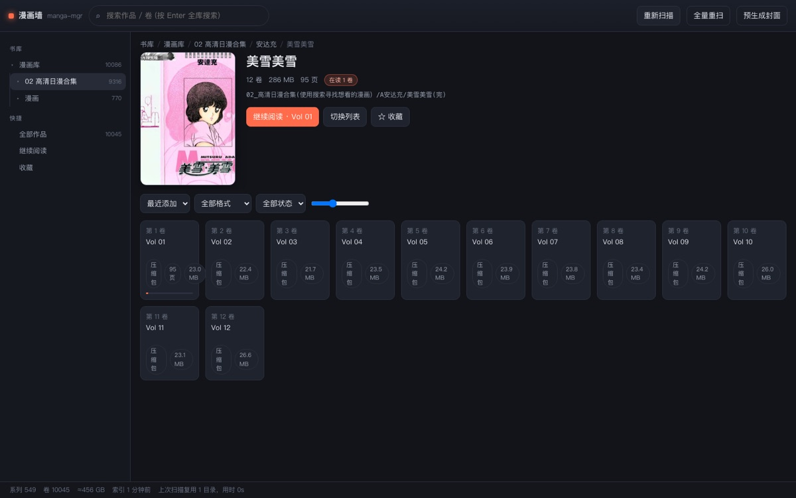
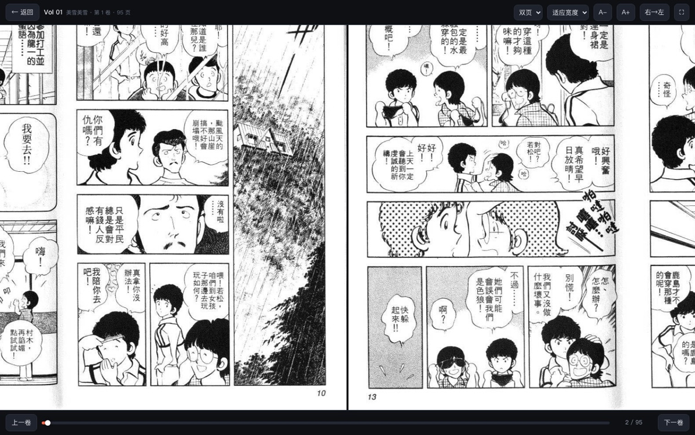

# 漫画墙 · manga-mgr

自托管的本地漫画管理 / 阅读器。扫描 NAS 或本地磁盘上的漫画目录（PDF、ZIP/RAR/7z、MOBI、EPUB、图片文件夹），
生成封面墙并直接在浏览器里阅读，带阅读进度、收藏和搜索。

面向本机使用（默认只监听 `127.0.0.1`），没有数据库、没有构建步骤，只有 Node.js + Express 和一个纯前端页面。

## 功能

- **扫描漫画库**：递归扫描配置的目录，自动识别「分组 / 系列 / 单卷」三层结构
  - `作者目录/作品目录/第01卷.rar` → 作者为分组，作品为系列，文件为卷
  - 同一目录下同时有压缩包和图片文件夹（例如 `第10卷.rar` + `第11卷/第11卷/*.jpg`）也能正确合并成一卷
  - 自动过滤 `.downloading`、`.txt`、`.db` 等无用文件与空目录；`@eaDir`、`#recycle` 等 NAS 垃圾目录默认跳过
- **封面墙**：卡片网格 + 分组侧边栏 + 搜索 + 排序（最近添加 / 标题 / 卷数 / 阅读进度 / 大小）+ 格式与阅读状态筛选
- **阅读器**：三种模式（连续滚动 / 单页 / 双页）、三种适配（宽度 / 高度 / 页面）、缩放、右→左阅读方向、全屏、进度条跳转、键盘操作
- **格式支持**
  | 格式 | 阅读方式 |
  | --- | --- |
  | PDF | 浏览器内用 pdf.js 渲染（HTTP Range 按需读取，111MB 的单行本也不用整本下载） |
  | ZIP / CBZ / RAR / CBR / 7z | 本地解压缓存后逐页浏览（自动跳过封面/说明等非图片文件，按页码自然排序） |
  | MOBI / AZW3 | 直接解析 PalmDB/MOBI 记录，把内嵌图片按顺序取出（kindle 漫画资源本身就是图片集） |
  | EPUB | 按 OPF spine 顺序取出图片（漫画型 EPUB）；文字型 EPUB 会退化为下载原文件 |
  | 图片文件夹 | 直接读取原目录，不复制、不占额外空间 |
- **阅读进度与收藏**：存服务端 JSON，多浏览器共享；首页展示「继续阅读」，系列页显示已读/在读卷数
- **增量扫描**：按目录 mtime 判断变化，未改动的目录直接复用上次索引（本库 1 万卷：全量 50 秒 → 增量 0.3 秒）
- **缓存管理**：解压产物与封面存在本地 `cache/`，超过上限自动按最早使用时间清理

## 界面

书库首页（封面墙 + 继续阅读 + 分组）  


系列详情（卷列表、进度、收藏）  


阅读器 · 连续滚动  


阅读器 · 双页（右→左）  


MOBI 卷（直接读取内嵌图片） / PDF 卷（pdf.js 渲染）  


## 快速开始

```bash
cd /Users/huangjun/Documents/tools/manga-mgr
npm install
npm start
```

打开 <http://127.0.0.1:4311> 即可。

首次启动会写入一份 `config.json` 并开始全量扫描（约 50 秒扫描 3 万个文件，取决于 NAS 速度）。
之后每次启动都是「读缓存 + 后台增量扫描」，秒级可用。

## 配置 `config.json`

```json
{
  "port": 4311,
  "host": "127.0.0.1",
  "libraryDirs": [
    { "name": "漫画库", "path": "/path/to/your/manga" }
  ],
  "bookExtensions": [".pdf", ".mobi", ".epub", ".azw3", ".fb2", ".djvu"],
  "archiveExtensions": [".zip", ".rar", ".cbz", ".cbr", ".7z"],
  "imageExtensions": [".jpg", ".jpeg", ".png", ".webp", ".gif", ".bmp", ".avif", ".jfif"],
  "ignoreExtensions": [".txt", ".db", ".downloading", ".part", ".tmp", ".apk", ".exe", ".nfo", ".url", ".opf", ".xml", ".json"],
  "excludeNames": [],
  "coverWidth": 400,
  "cacheLimitGB": 30,
  "scanOnStart": true,
  "jobs": 2
}
```

| 字段 | 说明 |
| --- | --- |
| `port` / `host` | 监听地址，默认只对本机开放。想在手机/平板上看可改成 `"host": "0.0.0.0"`（注意同一局域网内可访问） |
| `libraryDirs` | 要扫描的根目录，可写多条；`name` 是界面上的书库名。可指向 NAS 挂载点、移动硬盘或本地目录 |
| `*Extensions` | 各类格式的扩展名白名单（`archive` 解压类、`book` 书本类、`image` 图片） |
| `ignoreExtensions` | 直接忽略的扩展名 |
| `excludeNames` | 额外要跳过的目录名（内置已跳过 `@eaDir`、`#recycle`、`System Volume Information` 等） |
| `coverWidth` | 封面缓存宽度（像素） |
| `cacheLimitGB` | `cache/extract` 解压缓存上限，超出后按最久未用清理 |
| `jobs` | 同时解压/生成封面的并发数，NAS 较慢可调小 |
| `scanOnStart` | 启动时自动扫描 |

## 使用

### 界面

- 左侧是书库树：点分组行进入该分组，点 `▸` 只展开不跳转
- 顶部搜索框回车 = 全库搜索（匹配系列名和卷名）
- 工具栏：排序、格式筛选、阅读状态筛选、卡片大小
- 右上角按钮：
  - **重新扫描**：增量扫描（只处理变动过的目录）
  - **全量重扫**：忽略缓存完整重扫（改了文件名但目录 mtime 没变、或长时间没扫描时用）
  - **预生成封面**：后台把所有作品的封面生成好，之后翻墙更流畅

### 阅读器快捷键

| 按键 | 作用 |
| --- | --- |
| `←` `→` `↑` `↓` `空格` `PageUp/PageDown` | 翻页（单页/双页模式下；`右→左` 开启时方向自动反过来） |
| `+` / `-` / `0` | 放大 / 缩小 / 还原 |
| `Home` / `End` | 第一页 / 最后一页 |
| `f` | 全屏 |
| `Esc` | 退出阅读器 |

滚动模式下鼠标移到页面边缘会出现上下工具条，3 秒无操作自动隐藏。
体积较大的压缩包/漫画 MOBI 在**首次打开**时会解压到本地缓存（顶部有进度提示），之后翻页是瞬时的。

部署实例（Ubuntu 22.04，书库是 CIFS 挂载的 NAS 目录，RAR 由 `bin/7zz` 解、封面由 poppler+Pillow 生成）：


## 在多个实例之间同步阅读记录

同一个书库在本地挂到 `/Volumes/YourDisk/manga/...`、在服务器上挂到 `/mnt/nas/Media/manga/...`，
而记录是按**绝对路径哈希**做 key 的，所以两边的 id 天然不同——直接拷 `progress.json` 是无效的。
`scripts/sync-progress.js` 会按「相对书库根的路径」把每条记录重新映射到目标实例的 id，
再通过目标实例的 HTTP API 写入（顺便校验该卷在目标库里确实存在）：

```bash
node scripts/sync-progress.js                 # 本地 -> 服务器（主机取自 deploy.local.sh）
node scripts/sync-progress.js --dry-run       # 只报告，不写入
node scripts/sync-progress.js --from-remote   # 反向：服务器 -> 本地
node scripts/sync-progress.js --host user@other-box   # 或 $MANGA_HOST
```

- 语义是**合并**而不是覆盖：目标端更新（`updatedAt` 更大）的记录会跳过，收藏取并集；`--force` 可强制覆盖
- 按 `updatedAt` 从旧到新写入，所以目标端的「继续阅读」顺序与原实例一致
- 结束时会打印同步条数、跳过条数、无法匹配的条数（目标库没有这本书），以及目标端「继续阅读」可解析条数


## 部署到 Linux 服务器

已在一台 Ubuntu 22.04 上完整跑通（无 root、无外网也能装起来）。
程序对平台能力是自适应的，启动时会打印检测结果（例如 `archive: 7zip / pdf cover: poppler / resize: pillow`）。

| 能力 | macOS | Linux |
| --- | --- | --- |
| ZIP / CBZ / EPUB | 内置读取器 | 内置读取器（纯 JS，无需任何命令） |
| RAR / CBR / 7z | 系统自带 `bsdtar` | `libarchive-tools`；装不了包就用 `bin/7zz`（见下） |
| PDF 封面 | `qlmanage`（Quick Look） | `pdftocairo` / `pdftoppm`（poppler-utils）或 `mutool` |
| 封面缩放 | `sips` | Pillow（python3-pil）→ gdk-pixbuf → ImageMagick → ffmpeg |
| PDF 阅读 | 浏览器内 pdf.js + HTTP Range（两端一致） | 同左 |
| MOBI / 图片文件夹 | 纯 JS 解析，两端一致 | 同左 |

缺少 RAR 解压能力时程序仍可运行，界面底部会显示「RAR/7z 不可读」警告，ZIP/PDF/MOBI 不受影响。

### 1. Node（用户级，无需 root）

```bash
# 在能上网的机器上下载对应架构的 Node LTS
curl -O https://nodejs.org/dist/v24.21.0/node-v24.21.0-linux-x64.tar.xz
ssh user@server 'mkdir -p ~/.local'
scp node-v24.21.0-linux-x64.tar.xz user@server:~/.local/
# 服务器上解压并放进 PATH
ssh user@server 'cd ~/.local && tar -xJf node-v24.21.0-linux-x64.tar.xz && ln -sfn node-v24.21.0-linux-x64 node \
  && mkdir -p ~/.local/bin && for b in node npm npx; do ln -sfn ~/.local/node/bin/$b ~/.local/bin/$b; done'
```

### 2. 拷贝程序

`node_modules` 直接带过去即可（express、pdfjs-dist 都是纯 JS），服务器没有 npm 源也能跑：

```bash
rsync -az --exclude=cache/ --exclude=data/ --exclude=config.json ./ user@server:~/manga-mgr/
```

### 3. RAR / 7z 支持（服务器无法 apt 安装时）

把 7-Zip 官方 Linux 版里的 `7zz` 放进 `manga-mgr/bin/`，程序会优先使用它（支持 RAR、RAR5、7z、ZIP）：

```bash
curl -O https://www.7-zip.org/a/7z2501-linux-x64.tar.xz && tar -xJf 7z2501-linux-x64.tar.xz 7zz
scp 7zz user@server:~/manga-mgr/bin/
ssh user@server 'chmod +x ~/manga-mgr/bin/7zz && ~/manga-mgr/bin/7zz | head -2'
```

### 4. 配置

把 `libraryDirs` 指到服务器上的挂载点（例如 CIFS 挂载的 `/mnt/nas/Media/manga`），`host` 设为 `0.0.0.0`
才能从局域网其它设备访问（注意：程序没有登录鉴权，只建议在家庭内网这样开）：

```json
{ "host": "0.0.0.0", "port": 4311, "libraryDirs": [{ "name": "漫画库", "path": "/mnt/nas/Media/manga" }] }
```

### 5. 开机自启（systemd 用户服务）

```ini
# ~/.config/systemd/user/manga-mgr.service
[Unit]
Description=manga-mgr (漫画墙)
After=network-online.target

[Service]
WorkingDirectory=/home/USER/manga-mgr
Environment=PATH=/home/USER/.local/bin:/usr/local/bin:/usr/bin:/bin
ExecStartPre=/bin/sh -c 'ls "/mnt/nas/Media/manga" >/dev/null 2>&1 || true'   # 触发 CIFS automount
ExecStart=/home/USER/.local/bin/node /home/USER/manga-mgr/server.js
Restart=on-failure
[Install]
WantedBy=default.target
```

```bash
systemctl --user daemon-reload && systemctl --user enable --now manga-mgr
loginctl enable-linger $USER          # 注销后仍保持运行（可能需要 sudo 授权一次）
systemctl --user status manga-mgr     # 查看状态
journalctl --user -u manga-mgr -f     # 看日志
```

更新代码后，一条命令即可（会保留远端的 `cache/`、`data/` 和 `config.json`）。
目标主机不写进仓库，放在被 git-ignore 的本地文件里：

```bash
cp scripts/deploy.local.sh.example scripts/deploy.local.sh
$EDITOR scripts/deploy.local.sh          # 填 MANGA_HOST="you@your-server"

./scripts/deploy.sh                      # 之后直接跑
./scripts/deploy.sh user@other-host      # 或临时指定另一台
```

等价于 `rsync -az --exclude=cache/ --exclude=data/ --exclude=config.json ./ user@host:~/manga-mgr/`
再 `systemctl --user restart manga-mgr`。

## 目录结构

```
manga-mgr/
├── server.js            # Express 路由与启动
├── lib/
│   ├── config.js        # 配置加载与默认值
│   ├── scanner.js       # 目录扫描、系列分组、增量索引
│   ├── pages.js         # 卷 → 页列表，解压缓存与淘汰
│   ├── covers.js        # 封面生成队列与缓存
│   ├── archive.js       # bsdtar 封装（rar / 7z / 兜底 zip）
│   ├── zip.js           # 内置 ZIP 读取器（只解需要的条目）
│   ├── mobi.js          # MOBI/PalmDB 内嵌图片解析
│   ├── progress.js      # 阅读进度与收藏
│   └── util.js          # 标题解析、自然排序、路径安全等
├── public/              # 前端（无构建步骤）
├── test/run.js          # 测试：解析 / 扫描 / 解压 / 封面 / 在线 API
├── cache/               # 生成的封面与解压缓存（可随时删除）
└── data/                # index.json / progress.json / pdfmeta.json
```

## 工作原理

1. **索引**：扫描只做目录列举，不 stat 每个文件；系列/卷的 id 由路径哈希得到，所以阅读进度在重扫后依然有效。
   索引保存在 `data/index.json`，增量扫描时先 stat 上次记录过的目录，只有 mtime 变化的分支才重新列举。
2. **阅读**：压缩包与 MOBI 首次打开时解压/抽取到 `cache/extract/<id>/`（图片文件夹直接读原目录），
   页图片通过 `/api/page/<卷id>/<页码>` 提供，浏览器按需加载。
3. **封面**：只在卡片滚动到视野内时生成，压缩包/RAR 只解码第一个图片条目（不整包解压），PDF 用 macOS 自带的 Quick Look 渲染首页，MOBI 直接取 EXTH 里记录的封面页。
4. **PDF**：`/api/file/<id>` 支持 HTTP Range，前端 pdf.js 只取需要的片段并懒渲染画布。

## 测试

```bash
npm test              # 单元 + 临时目录夹具（解析、扫描、ZIP、解压、封面）
npm test -- --api     # 额外对运行中的服务做在线测试（会用真实书库各格式各取一卷验证）
```

在线测试会：读取书库树、逐个格式（PDF / 压缩包 / MOBI / 图片文件夹）打开一卷 →
校验页图与封面能取到、PDF Range 返回 206。

## 常见问题

- **端口被占用**：报 `EADDRINUSE`，改 `config.json` 里的 `port`（默认 4311 被 QQ 等软件占过）。
- **NAS 没挂载**：不影响启动，会沿用上次索引；封面/解压会失败，重新挂载后点「重新扫描」。
- **缺 `unrar` / `7z` 命令？** 不需要：RAR/7z/ZIP 都由系统自带的 `bsdtar`（libarchive）处理，ZIP 另外走内置读取器。
- **封面一直是占位图**：封面是懒生成的，NAS 慢时会逐个出现；也可以点「预生成封面」让它一次跑完。
- **PDF 页数显示为空**：PDF 的页数在第一次打开后由前端回报并缓存，属正常现象。
- **想清空缓存**：直接删 `cache/`（封面与解压产物，会自动重建），或删 `data/`（索引与进度，下次启动全量重扫）。
- **改完代码不生效**：`public/` 下的文件不做长缓存，普通刷新即可；改 `lib/`、`server.js` 需要重启进程。

## 已知限制

- 文字为主的 MOBI / EPUB（小说）不做排版渲染，只索引、提供下载。
- 7z 单条读取需要流式扫描整个包（本库仅 3 个 7z 文件），封面首次生成会慢几秒。
- 目录 mtime 未变化时不会发现文件内容变化（例如原地替换同名文件），需要「全量重扫」。
